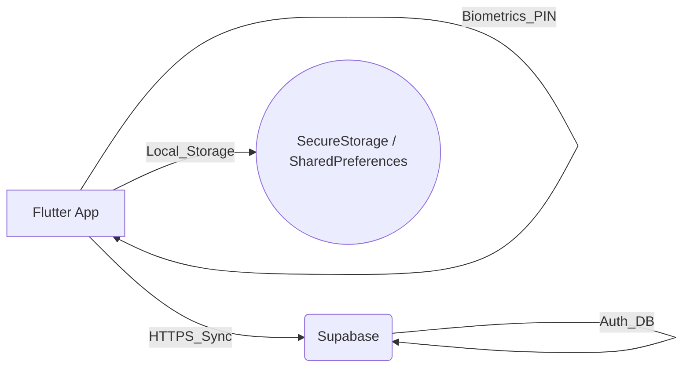
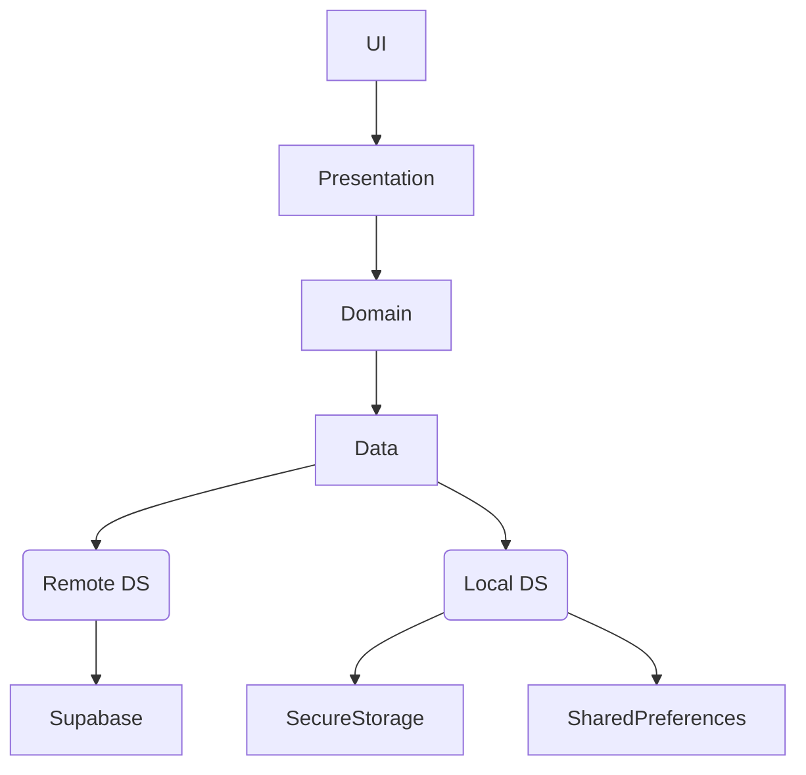
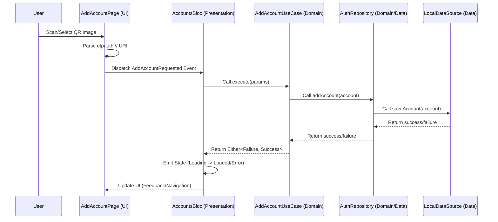
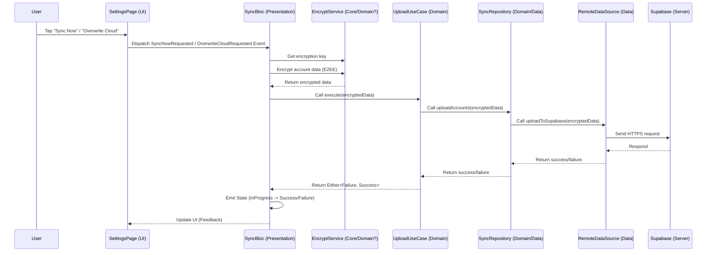
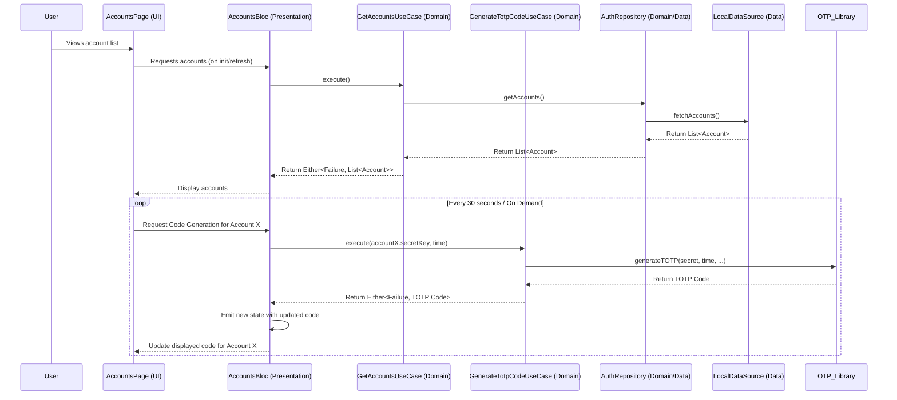
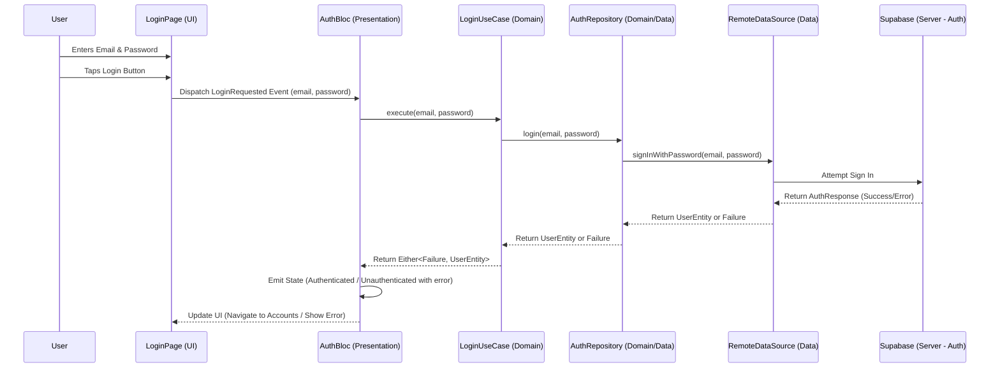
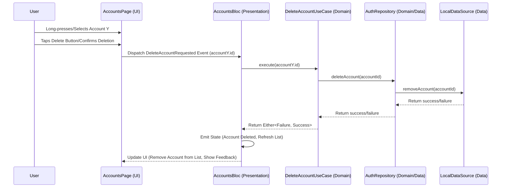
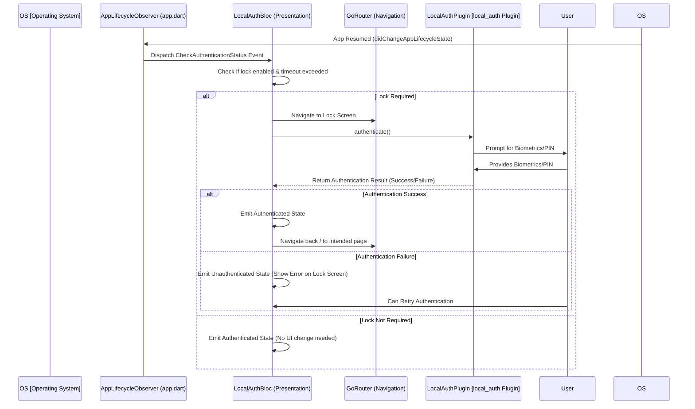

# Hyper Authenticator: System Design Document

## 1. Introduction
This document outlines the system design and architecture for Hyper Authenticator, a cross-platform two-factor authentication (2FA) application built with Flutter. It details the architectural choices, components, data flow, and security considerations, aligning with the project's goal of providing a robust and secure TOTP-based 2FA solution across multiple platforms (Android, iOS, Web, Windows, macOS) with biometric integration.

## 2. System Architecture: Client-Server Model
Hyper Authenticator primarily operates as a client-side application but utilizes a Client-Server model for optional features like user authentication and cloud synchronization.

*   **Client (Flutter Application):** The core application runs on the user's device (Android, iOS, Web, Windows, macOS). It handles:
    *   Secure storage of TOTP secrets.
    *   TOTP code generation (RFC 6238).
    *   User interface and interaction.
    *   Biometric/PIN authentication for app lock.
    *   QR code scanning and image analysis.
    *   (If sync enabled) Communication with the backend for data synchronization.
*   **Server (Supabase):** A Backend-as-a-Service (BaaS) platform used for:
    *   **User Authentication:** Manages user registration and login, allowing users to have an account associated with their synchronized data.
    *   **Database/Storage:** Securely stores encrypted user account data (TOTP secrets, issuer, account name, etc.) when cloud sync is enabled. Supabase provides database and storage solutions suitable for this purpose.

**Diagram (Simplified for GitHub Rendering):**

## 3. Flutter Application Architecture: Clean Architecture

**Layer Diagram (Simplified for GitHub Rendering):**

The Flutter application adheres to the principles of Clean Architecture to ensure separation of concerns, testability, and maintainability.

*   **Core Principles:**
    *   **Presentation Layer:** Handles UI (Widgets, Pages) and State Management. Responsible for displaying data and handling user input.
        *   **UI:** Built with Flutter widgets.
        *   **State Management:** Primarily uses `flutter_bloc` (`AccountsBloc`, `AuthBloc`, `SyncBloc`, `LocalAuthBloc`, `SettingsBloc`) for managing feature states and `provider` for theme management (`ThemeProvider`).
    *   **Domain Layer:** Contains the core business logic, independent of UI and data storage details.
        *   **Entities:** Represent core business objects (e.g., `AuthenticatorAccount`, `UserEntity`).
        *   **UseCases:** Encapsulate specific application tasks (e.g., `AddAccountUseCase`, `GetAccountsUseCase`, `GenerateTotpCodeUseCase`, `DeleteAccountUseCase`, `LoginUseCase`, `LogoutUseCase`, `UploadAccountsUseCase`, `DownloadAccountsUseCase`, `CheckAuthStatusUseCase`, `AuthenticateWithBiometricsUseCase`).
        *   **Repository Interfaces:** Define contracts for data operations, implemented by the Data Layer.
    *   **Data Layer:** Implements the repository interfaces defined in the Domain Layer. Responsible for retrieving data from and storing data to various sources.
        *   **Repositories:** Concrete implementations (e.g., `AuthenticatorRepositoryImpl`, `SyncRepositoryImpl`).
        *   **Data Sources:** Abstract interactions with specific storage mechanisms (e.g., `AuthenticatorLocalDataSource`, `SyncRemoteDataSource`, `AuthRemoteDataSource`). Concrete implementations interact with Supabase, `FlutterSecureStorage`, `SharedPreferences`.
        *   **Data Models/DTOs:** Data transfer objects used for remote communication or local storage (e.g., `SyncedAccountDto`). Often include mapping logic to/from Domain Entities.
*   **Cross-Platform Considerations:** Flutter's framework allows building for multiple platforms from a single codebase. Platform-specific integrations (like `local_auth` for biometrics) are handled using plugins that abstract platform differences. The architecture remains consistent across platforms.
*   **Directory Structure:** Organized by features (`auth`, `authenticator`, `sync`, `settings`) with internal `data`, `domain`, `presentation` layers, promoting modularity.

## 4. Key Technology Deep Dive
*   **TOTP Algorithm (RFC 6238):**
    *   The `otp` package is used, which implements the standard TOTP algorithm.
    *   It takes a Base32 encoded secret key, the current time, and parameters (period, digits, algorithm - SHA1, SHA256, SHA512) to generate a time-based one-time password.
    *   Secrets are securely stored locally using `FlutterSecureStorage`.
*   **Biometric Technology (`local_auth`):**
    *   The `local_auth` plugin provides access to the device's native biometric authentication capabilities (fingerprint, face recognition) or PIN/pattern/password.
    *   Used for the App Lock feature (`LockScreenPage`, `LocalAuthBloc`).
    *   `LocalAuthBloc` manages the authentication state (locked/unlocked) and interacts with the plugin.
    *   The application lifecycle (`WidgetsBindingObserver` in `app.dart`) triggers authentication checks when the app resumes and resets the status when it pauses, ensuring security.
*   **Dependency Injection (`GetIt` / `Injectable`):**
    *   Simplifies dependency management across layers.
    *   `Injectable` automatically generates registration code based on annotations (`@injectable`, `@lazySingleton`, `@module`, `@preResolve`).
    *   Ensures loose coupling and improves testability.
*   **Routing (`GoRouter`):**
    *   Provides a declarative routing solution suitable for complex navigation scenarios.
    *   The router configuration (`AppRouter`) depends on `AuthBloc` and `LocalAuthBloc` states to handle redirects (e.g., redirecting to login if not authenticated, redirecting to lock screen if app lock is enabled and triggered).
    *   **Local Storage (`FlutterSecureStorage` / `SharedPreferences`):**
        *   `FlutterSecureStorage` is chosen for sensitive data (TOTP secrets, potentially E2EE keys) because it utilizes platform-specific secure storage (Keystore/Keychain), offering hardware-backed protection where available.
        *   `SharedPreferences` is used for non-sensitive user preferences (like theme settings, sync enabled status) as it's simpler and sufficient for non-critical data.

## 5. Security Considerations
*   **Local Storage:**
    *   **Sensitive Data (TOTP Secrets):** Stored using `FlutterSecureStorage`, which leverages platform-specific secure storage mechanisms (Keystore on Android, Keychain on iOS).
    *   **Non-Sensitive Data (Settings):** Stored using `SharedPreferences`.
*   **App Lock:** Uses device-level biometric/PIN authentication via `local_auth`, preventing unauthorized access to the app even if the device is unlocked.
*   **Cloud Synchronization Security (Current & Planned):**
    *   **Authentication:** User authentication via Supabase ensures only authorized users can access their sync data.
    *   **Transport Security:** Communication with Supabase occurs over HTTPS.
    *   **Data-at-Rest (Supabase - Current State):** Currently, data synchronized to Supabase relies on Supabase's built-in security features and potentially server-side encryption options provided by the platform. The raw TOTP secrets might be stored directly if E2EE is not yet implemented.
    *   **Planned End-to-End Encryption (E2EE):**
        *   **Goal:** To ensure that sensitive TOTP secrets are encrypted *before* leaving the client device, making them unreadable by the backend provider (Supabase) or any intermediary.
        *   **Approach:**
            1.  **Key Generation:** Generate a strong, unique encryption key per user on the client-side. Options include:
                *   Deriving from a user-defined master password (using a KDF like Argon2 or PBKDF2).
                *   Generating a random key and storing it securely in `FlutterSecureStorage`.
            2.  **Encryption:** Before uploading via `UploadAccountsUseCase`, encrypt sensitive fields (especially `secretKey`) using the client-side key (e.g., AES-GCM via `cryptography` package).
            3.  **Storage:** Store only the *encrypted* ciphertext in Supabase.
            4.  **Decryption:** When downloading via `DownloadAccountsUseCase`, retrieve the ciphertext and decrypt it on the client-side using the user's key.
        *   **Key Management Challenges:**
            *   **Security:** The client-side key is the root of trust. If stored directly, `FlutterSecureStorage` is essential. If derived, the master password must be strong.
            *   **Recovery:** If the key (or master password) is lost, encrypted data becomes inaccessible. Implementing a secure recovery mechanism (e.g., recovery codes stored by the user) is complex but necessary.
            *   **Cross-Device Access:** The key must be available on all devices where the user wants to access synced data. This might involve securely transferring the key or requiring the user to re-enter the master password on each new device.

## 6. Data Flow Examples

### 6.1. Adding Account via QR Scan/Image

**Description:** This flow illustrates how a user adds a new 2FA account by scanning a QR code or selecting an image containing one. The application parses the `otpauth://` URI, saves the account details securely to local storage via the BLoC and Repository layers.

### 6.2. Synchronization Flow (Upload with Planned E2EE)

**Description:** This diagram shows the process of uploading local account data to the Supabase backend for synchronization. It includes the planned End-to-End Encryption step where data is encrypted client-side before being sent, ensuring the server cannot access the raw secrets.

### 6.3. TOTP Code Generation

**Description:** This flow details how the application generates a Time-based One-Time Password (TOTP) for a selected account. It involves retrieving the account's secret key from secure storage and using the `otp` library to compute the current code based on the time.

### 6.4. User Authentication (Login)

**Description:** This diagram outlines the user login process using Supabase authentication. The user enters credentials, which are passed through the BLoC and UseCase layers to the Repository, ultimately calling the Supabase Auth service for verification.

### 6.5. Deleting an Account

**Description:** This flow shows how a user deletes an existing 2FA account. The request goes through the BLoC and UseCase to the Repository, which then instructs the Local Data Source to remove the account from secure storage.

### 6.6. App Lock Authentication (On App Resume)

**Description:** This diagram illustrates the process when the app resumes from the background and the App Lock feature is enabled. The `WidgetsBindingObserver` triggers the `LocalAuthBloc` to check if authentication is needed, which then interacts with the `local_auth` plugin to prompt the user for biometrics/PIN.

## 7. Error Handling
The application uses the `Either<Failure, SuccessType>` pattern (from the `dartz` package) extensively in the Domain and Data layers to handle expected failures gracefully without throwing exceptions for common issues.

*   **`Failure` Types:** Specific `Failure` subclasses represent different error categories:
    *   `ServerFailure`: Errors from the backend (e.g., Supabase API errors, 5xx status codes).
    *   `CacheFailure`: Errors related to local storage (e.g., `FlutterSecureStorage` read/write errors).
    *   `NetworkFailure`: Issues with network connectivity.
    *   `AuthenticationFailure`: Errors during login, registration, or token issues.
    *   `EncryptionFailure`: Errors during E2EE encryption/decryption.
    *   `PermissionFailure`: Errors related to missing permissions (e.g., camera for QR scan).
    *   `InvalidInputFailure`: Errors due to invalid user input (though often handled via form validation in Presentation).
*   **Presentation Layer Handling:** BLoCs receive the `Either` type from UseCases.
    *   On `Left(Failure)`, the BLoC emits an error state (e.g., `AccountsLoadFailure`, `SyncFailure`).
    *   The UI layer listens to these states and displays appropriate user feedback (e.g., Snackbars, error messages within widgets, specific error pages). The feedback aims to be user-friendly, explaining the issue simply (e.g., "Could not connect to server", "Invalid login details", "Failed to save account").
    *   On `Right(SuccessType)`, the BLoC emits a success state with the required data.
Uses `Either<Failure, SuccessType>` and specific `Failure` types.