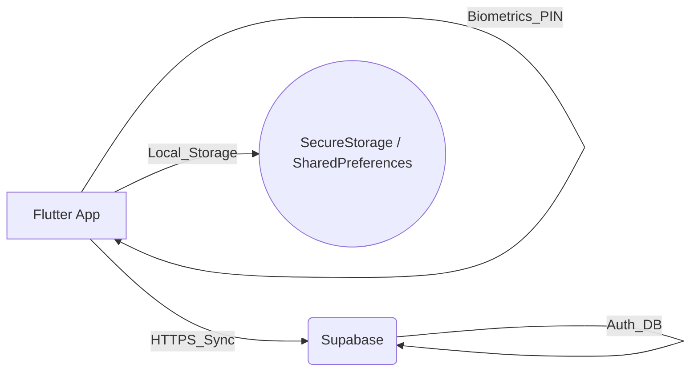
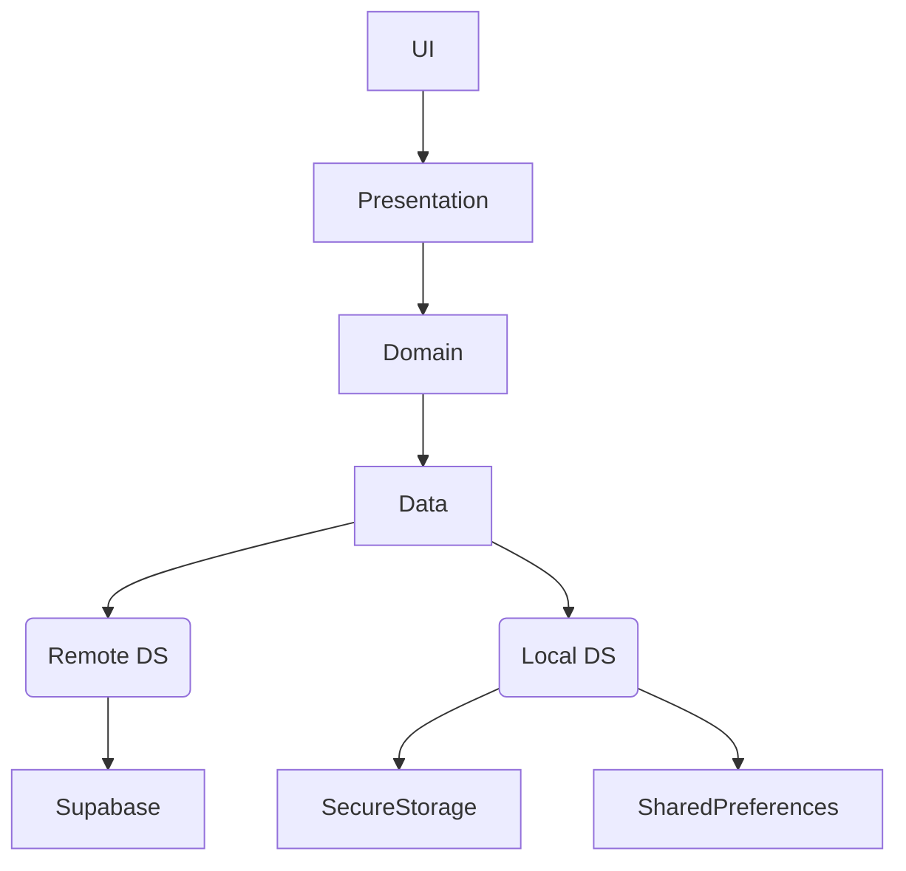
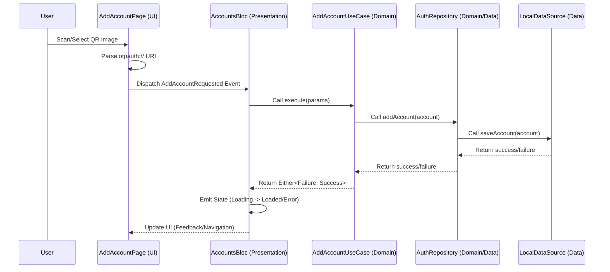
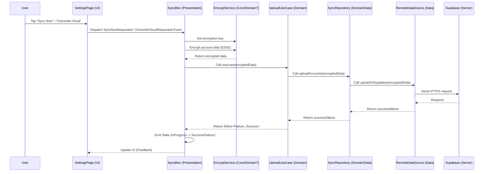

# Hyper Authenticator: System Design Document

## 1. Introduction
This document outlines the system design and architecture for Hyper Authenticator, a cross-platform two-factor authentication (2FA) application built with Flutter. It details the architectural choices, components, data flow, and security considerations, aligning with the project's goal of providing a robust and secure TOTP-based 2FA solution across multiple platforms (Android, iOS, Web, Windows, macOS) with biometric integration.

## 2. System Architecture: Client-Server Model
Hyper Authenticator primarily operates as a client-side application but utilizes a Client-Server model for optional features like user authentication and cloud synchronization.

*   **Client (Flutter Application):** The core application runs on the user's device (Android, iOS, Web, Windows, macOS). It handles:
    *   Secure storage of TOTP secrets.
    *   TOTP code generation (RFC 6238).
    *   User interface and interaction.
    *   Biometric/PIN authentication for app lock.
    *   QR code scanning and image analysis.
    *   (If sync enabled) Communication with the backend for data synchronization.
*   **Server (Supabase):** A Backend-as-a-Service (BaaS) platform used for:
    *   **User Authentication:** Manages user registration and login, allowing users to have an account associated with their synchronized data.
    *   **Database/Storage:** Securely stores encrypted user account data (TOTP secrets, issuer, account name, etc.) when cloud sync is enabled. Supabase provides database and storage solutions suitable for this purpose.

**Diagram (Simplified for GitHub Rendering):**

## 3. Flutter Application Architecture: Clean Architecture

**Layer Diagram (Simplified for GitHub Rendering):**

The Flutter application adheres to the principles of Clean Architecture to ensure separation of concerns, testability, and maintainability.

*   **Core Principles:**
    *   **Presentation Layer:** UI (Widgets, Pages) and State Management (BLoC). Responsible for displaying data and handling user input. Uses `flutter_bloc` for state management and `provider` for theme management.
    *   **Domain Layer:** Core business logic (UseCases, Entities) and Repository interfaces. Defines *what* the application does, independent of implementation details. Contains `AuthenticatorAccount` entity and use cases like `AddAccount`, `GenerateTotpCode`, `GetAccounts`.
    *   **Data Layer:** Implementation of Repositories, Data Sources (local and remote), and data mapping. Responsible for *how* data is fetched and stored. Includes `AuthenticatorRepositoryImpl`, `AuthenticatorLocalDataSource`, `SyncRemoteDataSource`, etc.
*   **Cross-Platform Considerations:** Flutter's framework allows building for multiple platforms from a single codebase. Platform-specific integrations (like `local_auth` for biometrics) are handled using plugins that abstract platform differences. The architecture remains consistent across platforms.
*   **Directory Structure:** Organized by features (`auth`, `authenticator`, `sync`, `settings`) with internal `data`, `domain`, `presentation` layers, promoting modularity.

## 4. Key Technology Deep Dive
*   **TOTP Algorithm (RFC 6238):**
    *   The `otp` package is used, which implements the standard TOTP algorithm.
    *   It takes a Base32 encoded secret key, the current time, and parameters (period, digits, algorithm - SHA1, SHA256, SHA512) to generate a time-based one-time password.
    *   Secrets are securely stored locally using `FlutterSecureStorage`.
*   **Biometric Technology (`local_auth`):**
    *   The `local_auth` plugin provides access to the device's native biometric authentication capabilities (fingerprint, face recognition) or PIN/pattern/password.
    *   Used for the App Lock feature (`LockScreenPage`, `LocalAuthBloc`).
    *   `LocalAuthBloc` manages the authentication state (locked/unlocked) and interacts with the plugin.
    *   The application lifecycle (`WidgetsBindingObserver` in `app.dart`) triggers authentication checks when the app resumes and resets the status when it pauses, ensuring security.
*   **Dependency Injection (`GetIt` / `Injectable`):**
    *   Simplifies dependency management across layers.
    *   `Injectable` automatically generates registration code based on annotations (`@injectable`, `@lazySingleton`, `@module`, `@preResolve`).
    *   Ensures loose coupling and improves testability.
*   **Routing (`GoRouter`):**
    *   Provides a declarative routing solution suitable for complex navigation scenarios.
    *   The router configuration (`AppRouter`) depends on `AuthBloc` and `LocalAuthBloc` states to handle redirects (e.g., redirecting to login if not authenticated, redirecting to lock screen if app lock is enabled and triggered).

## 5. Security Considerations
*   **Local Storage:**
    *   **Sensitive Data (TOTP Secrets):** Stored using `FlutterSecureStorage`, which leverages platform-specific secure storage mechanisms (Keystore on Android, Keychain on iOS).
    *   **Non-Sensitive Data (Settings):** Stored using `SharedPreferences`.
*   **App Lock:** Uses device-level biometric/PIN authentication via `local_auth`, preventing unauthorized access to the app even if the device is unlocked.
*   **Cloud Synchronization Security (Current & Planned):**
    *   **Authentication:** User authentication via Supabase ensures only authorized users can access their sync data.
    *   **Transport Security:** Communication with Supabase occurs over HTTPS.
    *   **Data-at-Rest (Supabase):** Supabase provides server-side encryption options.
    *   **Planned End-to-End Encryption (E2EE):**
        *   **Goal:** To ensure that even the backend provider (Supabase) cannot read the user's sensitive TOTP secrets stored for synchronization.
        *   **Approach:**
            1.  **Key Generation:** Generate a strong encryption key on the client-side. This key could be derived from the user's master password (requiring the user to set one) or generated randomly and stored securely (e.g., in `FlutterSecureStorage`, potentially protected by biometrics). *Managing this key securely is critical.*
            2.  **Encryption:** Before uploading account data (`AuthenticatorAccount` details) via `UploadAccountsUseCase`, encrypt the sensitive fields (especially `secretKey`) using the client-side key and the `cryptography` package (e.g., AES-GCM).
            3.  **Storage:** Store the *encrypted* data in Supabase.
            4.  **Decryption:** When downloading data via `DownloadAccountsUseCase`, retrieve the encrypted data and decrypt it on the client-side using the same client-side key.
        *   **Challenges:** Secure key management, key recovery (if the user forgets the master password or loses the key), and ensuring the key is available across devices if needed for decryption after a fresh install.

## 6. Data Flow Examples

### Adding Account via QR Scan/Image

### Synchronization Flow (Upload with Planned E2EE)

(Similar flows apply to other features like code generation and authentication.)

## 7. Error Handling
Uses `Either<Failure, SuccessType>` and specific `Failure` types.