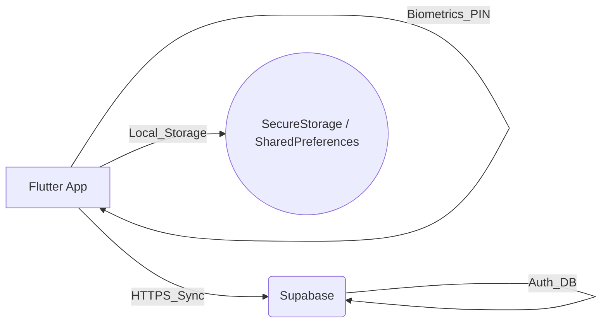
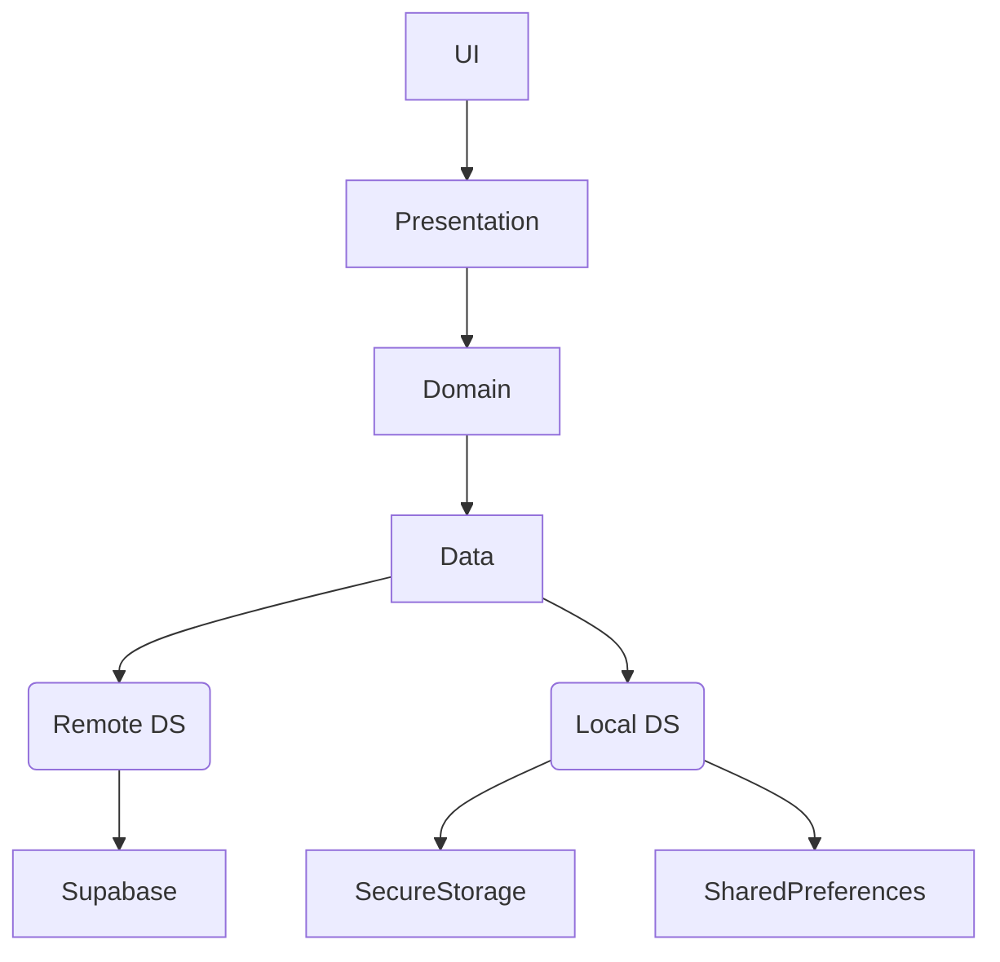
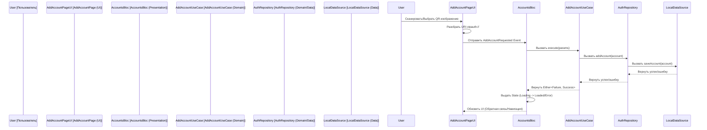
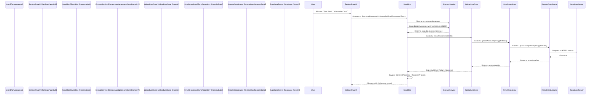

# Hyper Authenticator: Документ по Дизайну Системы

## 1. Введение
Этот документ описывает дизайн системы и архитектуру Hyper Authenticator, кроссплатформенного приложения для двухфакторной аутентификации (2FA), созданного с помощью Flutter. В нем подробно описаны архитектурные решения, компоненты, поток данных и соображения безопасности, соответствующие цели проекта по предоставлению надежного и безопасного решения 2FA на основе TOTP на нескольких платформах (Android, iOS, Web, Windows, macOS) с интеграцией биометрии.

## 2. Архитектура Системы: Модель Клиент-Сервер
Hyper Authenticator в основном работает как клиентское приложение, но использует модель Клиент-Сервер для опциональных функций, таких как аутентификация пользователя и облачная синхронизация.

*   **Клиент (Приложение Flutter):** Основное приложение работает на устройстве пользователя (Android, iOS, Web, Windows, macOS). Оно обрабатывает:
    *   Безопасное хранение секретов TOTP.
    *   Генерацию кодов TOTP (RFC 6238).
    *   Пользовательский интерфейс и взаимодействие.
    *   Биометрическую/PIN аутентификацию для блокировки приложения.
    *   Сканирование QR-кодов и анализ изображений.
    *   (Если синхронизация включена) Взаимодействие с бэкендом для синхронизации данных.
*   **Сервер (Supabase):** Платформа Backend-as-a-Service (BaaS), используемая для:
    *   **Аутентификации пользователя:** Управляет регистрацией и входом пользователей, позволяя им иметь учетную запись, связанную с их синхронизированными данными.
    *   **Базы данных/Хранилища:** Безопасно хранит зашифрованные данные учетных записей пользователей (секреты TOTP, издатель, имя учетной записи и т. д.), когда включена облачная синхронизация. Supabase предоставляет подходящие решения для баз данных и хранения.

**Диаграмма:**

## 3. Архитектура Приложения Flutter: Clean Architecture

**Диаграмма слоев:**

Приложение Flutter придерживается принципов Clean Architecture для обеспечения разделения ответственностей, тестируемости и поддерживаемости.

*   **Основные принципы:**
    *   **Presentation Layer:** UI (Виджеты, Страницы) и Управление состоянием (BLoC). Отвечает за отображение данных и обработку пользовательского ввода. Использует `flutter_bloc` для управления состоянием и `provider` для управления темой.
    *   **Domain Layer:** Основная бизнес-логика (UseCases, Entities) и интерфейсы Repository. Определяет, *что* делает приложение, независимо от деталей реализации. Содержит сущность `AuthenticatorAccount` и use cases, такие как `AddAccount`, `GenerateTotpCode`, `GetAccounts`.
    *   **Data Layer:** Реализация репозиториев, Источники данных (локальные и удаленные) и маппинг данных. Отвечает за то, *как* данные извлекаются и хранятся. Включает `AuthenticatorRepositoryImpl`, `AuthenticatorLocalDataSource`, `SyncRemoteDataSource` и т. д.
*   **Кроссплатформенные соображения:** Фреймворк Flutter позволяет создавать приложения для нескольких платформ из единой кодовой базы. Платформенно-специфичные интеграции (например, `local_auth` для биометрии) обрабатываются с помощью плагинов, которые абстрагируют различия платформ. Архитектура остается последовательной на всех платформах.
*   **Структура каталогов:** Организована по функциям (`auth`, `authenticator`, `sync`, `settings`) с внутренними слоями `data`, `domain`, `presentation`, что способствует модульности.

## 4. Глубокий анализ ключевых технологий
*   **Алгоритм TOTP (RFC 6238):**
    *   Используется пакет `otp`, который реализует стандартный алгоритм TOTP.
    *   Он принимает секретный ключ в кодировке Base32, текущее время и параметры (период, количество цифр, алгоритм - SHA1, SHA256, SHA512) для генерации одноразового пароля на основе времени.
    *   Секреты безопасно хранятся локально с использованием `FlutterSecureStorage`.
*   **Биометрическая технология (`local_auth`):**
    *   Плагин `local_auth` предоставляет доступ к нативным возможностям биометрической аутентификации устройства (отпечаток пальца, распознавание лица) или PIN/шаблону/паролю.
    *   Используется для функции блокировки приложения (`LockScreenPage`, `LocalAuthBloc`).
    *   `LocalAuthBloc` управляет состоянием аутентификации (заблокировано/разблокировано) и взаимодействует с плагином.
    *   Жизненный цикл приложения (`WidgetsBindingObserver` в `app.dart`) инициирует проверки аутентификации при возобновлении работы приложения и сбрасывает статус при приостановке, обеспечивая безопасность.
*   **Внедрение зависимостей (`GetIt` / `Injectable`):**
    *   Упрощает управление зависимостями между слоями.
    *   `Injectable` автоматически генерирует код регистрации на основе аннотаций (`@injectable`, `@lazySingleton`, `@module`, `@preResolve`).
    *   Обеспечивает слабую связанность и улучшает тестируемость.
*   **Маршрутизация (`GoRouter`):**
    *   Предоставляет декларативное решение для маршрутизации, подходящее для сложных сценариев навигации.
    *   Конфигурация маршрутизатора (`AppRouter`) зависит от состояний `AuthBloc` и `LocalAuthBloc` для обработки перенаправлений (например, перенаправление на вход, если не аутентифицирован, перенаправление на экран блокировки, если блокировка приложения включена и сработала).

## 5. Соображения безопасности
*   **Локальное хранилище:**
    *   **Чувствительные данные (Секреты TOTP):** Хранятся с использованием `FlutterSecureStorage`, который использует специфичные для платформы механизмы безопасного хранения (Keystore на Android, Keychain на iOS).
    *   **Нечувствительные данные (Настройки):** Хранятся с использованием `SharedPreferences`.
*   **Блокировка приложения:** Использует аутентификацию на уровне устройства (биометрия/PIN) через `local_auth`, предотвращая несанкционированный доступ к приложению, даже если устройство разблокировано.
*   **Безопасность облачной синхронизации (Текущая и Планируемая):**
    *   **Аутентификация:** Аутентификация пользователя через Supabase гарантирует, что только авторизованные пользователи могут получить доступ к своим данным синхронизации.
    *   **Безопасность передачи:** Связь с Supabase осуществляется по HTTPS.
    *   **Данные в состоянии покоя (Supabase):** Supabase предоставляет опции шифрования на стороне сервера.
    *   **Планируемое сквозное шифрование (E2EE):**
        *   **Цель:** Гарантировать, что даже поставщик бэкенда (Supabase) не сможет прочитать чувствительные секреты TOTP пользователя, хранящиеся для синхронизации.
        *   **Подход:**
            1.  **Генерация ключа:** Генерация сильного ключа шифрования на стороне клиента. Этот ключ может быть получен из мастер-пароля пользователя (требуя от пользователя его установки) или сгенерирован случайным образом и безопасно сохранен (например, в `FlutterSecureStorage`, потенциально защищенный биометрией). *Безопасное управление этим ключом критически важно.*
            2.  **Шифрование:** Перед загрузкой данных учетной записи (детали `AuthenticatorAccount`) через `UploadAccountsUseCase`, зашифровать чувствительные поля (особенно `secretKey`), используя ключ на стороне клиента и пакет `cryptography` (например, AES-GCM).
            3.  **Хранение:** Хранить *зашифрованные* данные в Supabase.
            4.  **Расшифровка:** При загрузке данных через `DownloadAccountsUseCase`, извлечь зашифрованные данные и расшифровать их на стороне клиента, используя тот же ключ на стороне клиента.
        *   **Проблемы:** Безопасное управление ключами, восстановление ключа (если пользователь забывает мастер-пароль или теряет ключ) и обеспечение доступности ключа на разных устройствах, если это необходимо для расшифровки после новой установки.

## 6. Примеры потока данных

### Добавление учетной записи через сканирование/выбор QR-изображения

### Поток синхронизации (Загрузка с планируемым E2EE)

(Аналогичные потоки применяются к другим функциям, таким как генерация кода и аутентификация.)

## 7. Обработка ошибок
Использует `Either<Failure, SuccessType>` и специфичные типы `Failure`.