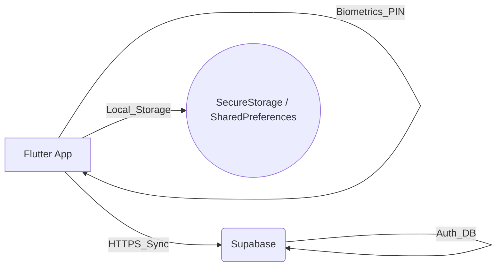
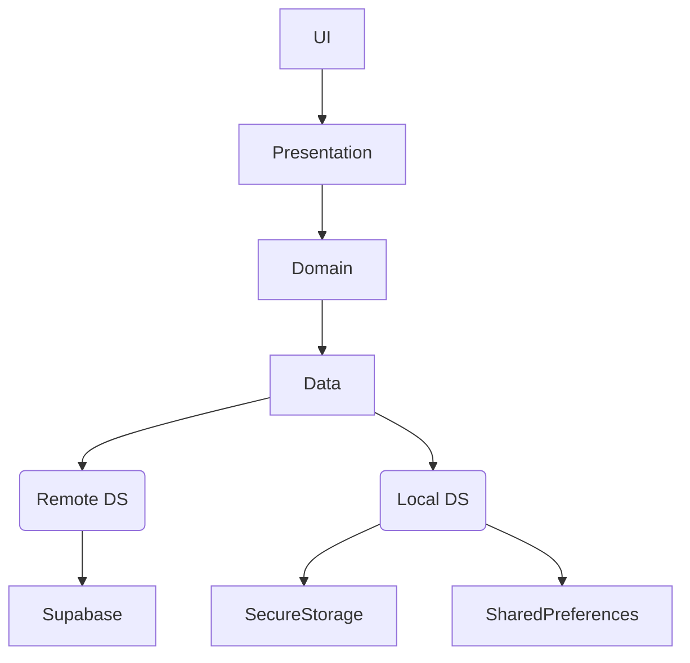
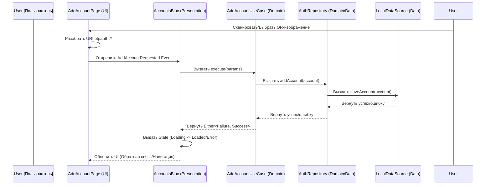
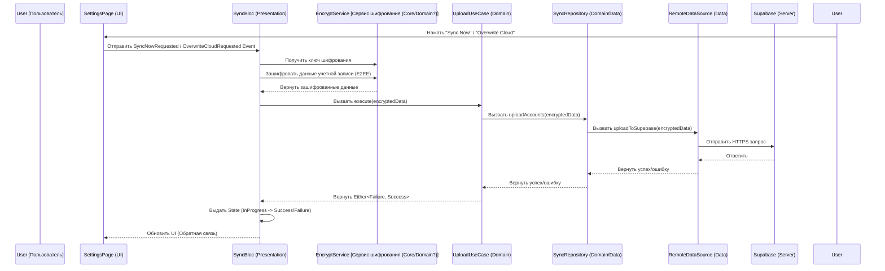
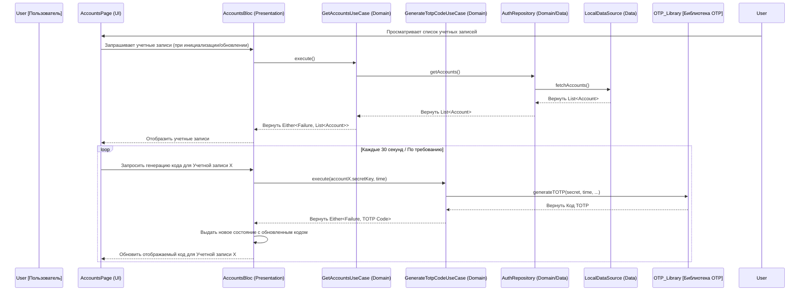
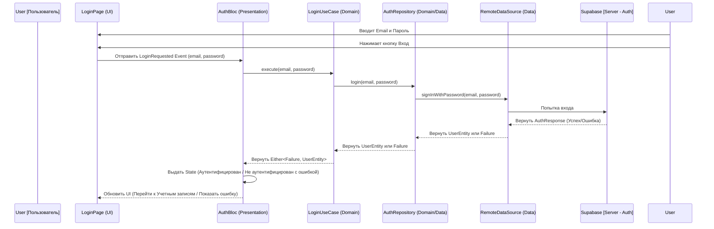
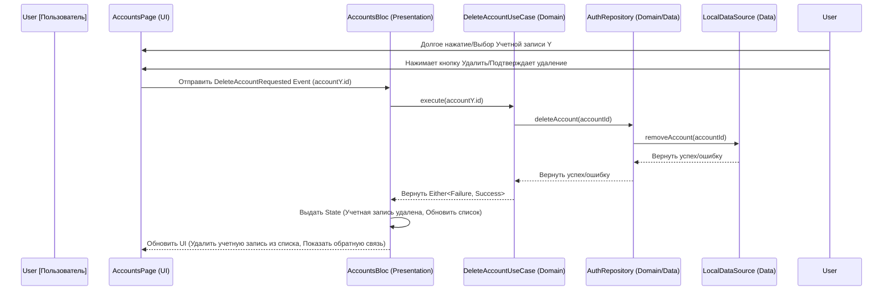
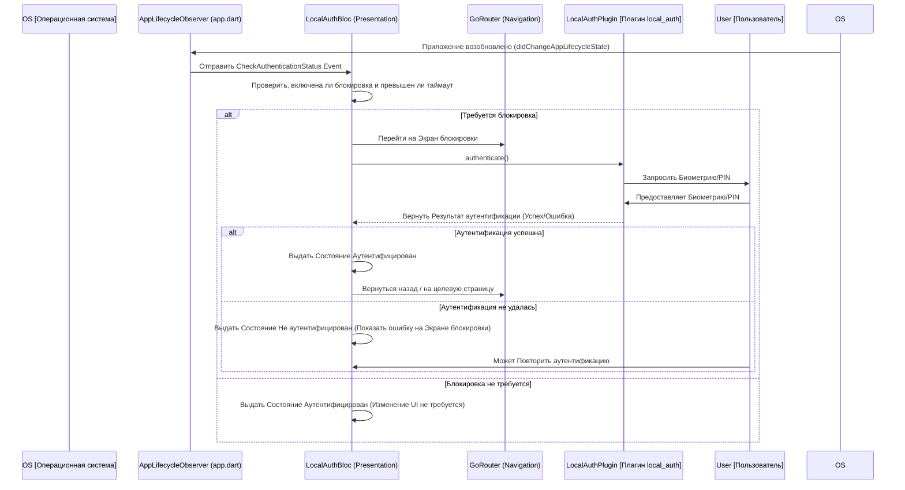

#  Hyper Authenticator: Документ по Дизайну Системы 📄

## 1. Введение
Этот документ описывает дизайн системы и архитектуру Hyper Authenticator, кроссплатформенного приложения для двухфакторной аутентификации (2FA), созданного с помощью Flutter. В нем подробно описаны архитектурные решения, компоненты, поток данных и соображения безопасности, соответствующие цели проекта по предоставлению надежного и безопасного решения 2FA на основе TOTP на нескольких платформах (Android, iOS, Web, Windows, macOS) с интеграцией биометрии.

## 2. 🏗️ Архитектура Системы: Модель Клиент-Сервер
Hyper Authenticator в основном работает как клиентское приложение, но использует модель Клиент-Сервер для опциональных функций, таких как аутентификация пользователя и облачная синхронизация.

*   **Клиент (Приложение Flutter):** Основное приложение работает на устройстве пользователя (Android, iOS, Web, Windows, macOS). Оно обрабатывает:
    *   Безопасное хранение секретов TOTP.
    *   Генерацию кодов TOTP (RFC 6238).
    *   Пользовательский интерфейс и взаимодействие.
    *   Биометрическую/PIN аутентификацию для блокировки приложения.
    *   Сканирование QR-кодов и анализ изображений.
    *   (Если синхронизация включена) Взаимодействие с бэкендом для синхронизации данных.
*   **Сервер (Supabase):** Платформа Backend-as-a-Service (BaaS), используемая для:
    *   **Аутентификации пользователя:** Управляет регистрацией и входом пользователей, позволяя им иметь учетную запись, связанную с их синхронизированными данными.
    *   **Базы данных/Хранилища:** Безопасно хранит зашифрованные данные учетных записей пользователей (секреты TOTP, издатель, имя учетной записи и т. д.), когда включена облачная синхронизация. Supabase предоставляет подходящие решения для баз данных и хранения.

**Диаграмма (Упрощенная для GitHub Rendering):**

## 3. 🧱 Архитектура Приложения Flutter: Clean Architecture

**Диаграмма слоев (Упрощенная для GitHub Rendering):**

Приложение Flutter придерживается принципов Clean Architecture для обеспечения разделения ответственностей, тестируемости и поддерживаемости.

*   **Основные принципы:**
    *   **Presentation Layer:** Обрабатывает UI (Виджеты, Страницы) и Управление состоянием. Отвечает за отображение данных и обработку пользовательского ввода.
        *   **UI:** Построен с использованием виджетов Flutter.
        *   **Управление состоянием:** В основном использует `flutter_bloc` (`AccountsBloc`, `AuthBloc`, `SyncBloc`, `LocalAuthBloc`, `SettingsBloc`) для управления состояниями функций и `provider` для управления темой (`ThemeProvider`).
    *   **Domain Layer:** Содержит основную бизнес-логику, независимую от UI и деталей хранения данных.
        *   **Entities:** Представляют основные бизнес-объекты (например, `AuthenticatorAccount`, `UserEntity`).
        *   **UseCases:** Инкапсулируют конкретные задачи приложения (например, `AddAccountUseCase`, `GetAccountsUseCase`, `GenerateTotpCodeUseCase`, `DeleteAccountUseCase`, `LoginUseCase`, `LogoutUseCase`, `UploadAccountsUseCase`, `DownloadAccountsUseCase`, `CheckAuthStatusUseCase`, `AuthenticateWithBiometricsUseCase`).
        *   **Repository Interfaces:** Определяют контракты для операций с данными, реализуемые слоем Data Layer.
    *   **Data Layer:** Реализует интерфейсы репозиториев, определенные в Domain Layer. Отвечает за извлечение данных из различных источников и их сохранение.
        *   **Repositories:** Конкретные реализации (например, `AuthenticatorRepositoryImpl`, `SyncRepositoryImpl`).
        *   **Data Sources:** Абстрагируют взаимодействия с конкретными механизмами хранения (например, `AuthenticatorLocalDataSource`, `SyncRemoteDataSource`, `AuthRemoteDataSource`). Конкретные реализации взаимодействуют с Supabase, `FlutterSecureStorage`, `SharedPreferences`.
        *   **Data Models/DTOs:** Объекты передачи данных, используемые для связи с внешними службами или для конкретных форматов хранения данных (например, `SyncedAccountDto`). Часто включают логику маппинга в/из Domain Entities.
*   **Кроссплатформенные соображения:** Фреймворк Flutter позволяет создавать приложения для нескольких платформ из единой кодовой базы. Платформенно-специфичные интеграции (например, `local_auth` для биометрии) обрабатываются с помощью плагинов, которые абстрагируют различия платформ. Архитектура остается последовательной на всех платформах.
*   **Структура каталогов:** Организована по функциям (`auth`, `authenticator`, `sync`, `settings`) с внутренними слоями `data`, `domain`, `presentation`, что способствует модульности.

## 4. ⚙️ Глубокий анализ ключевых технологий
*   **Алгоритм TOTP (RFC 6238):**
    *   Используется пакет `otp`, который реализует стандартный алгоритм TOTP.
    *   Он принимает секретный ключ в кодировке Base32, текущее время и параметры (период, количество цифр, алгоритм - SHA1, SHA256, SHA512) для генерации одноразового пароля на основе времени.
    *   Секреты безопасно хранятся локально с использованием `FlutterSecureStorage`.
*   **Биометрическая технология (`local_auth`):**
    *   Плагин `local_auth` предоставляет доступ к нативным возможностям биометрической аутентификации устройства (отпечаток пальца, распознавание лица) или PIN/шаблону/паролю.
    *   Используется для функции блокировки приложения (`LockScreenPage`, `LocalAuthBloc`).
    *   `LocalAuthBloc` управляет состоянием аутентификации (заблокировано/разблокировано) и взаимодействует с плагином.
    *   Жизненный цикл приложения (`WidgetsBindingObserver` в `app.dart`) инициирует проверки аутентификации при возобновлении работы приложения и сбрасывает статус при приостановке, обеспечивая безопасность.
*   **Внедрение зависимостей (`GetIt` / `Injectable`):**
    *   Упрощает управление зависимостями между слоями.
    *   `Injectable` автоматически генерирует код регистрации на основе аннотаций (`@injectable`, `@lazySingleton`, `@module`, `@preResolve`).
    *   Обеспечивает слабую связанность и улучшает тестируемость.
*   **Маршрутизация (`GoRouter`):**
    *   Предоставляет декларативное решение для маршрутизации, подходящее для сложных сценариев навигации.
    *   Конфигурация маршрутизатора (`AppRouter`) зависит от состояний `AuthBloc` и `LocalAuthBloc` для обработки перенаправлений (например, перенаправление на вход, если не аутентифицирован, перенаправление на экран блокировки, если блокировка приложения включена и сработала).
    *   **Локальное хранилище (`FlutterSecureStorage` / `SharedPreferences`):**
        *   `FlutterSecureStorage` выбран для чувствительных данных (секреты TOTP, потенциально ключи E2EE), поскольку он использует специфичные для платформы безопасные хранилища (Keystore/Keychain), предлагая аппаратную защиту там, где это возможно.
        *   `SharedPreferences` используется для нечувствительных пользовательских настроек (таких как настройки темы, статус включения синхронизации), так как он проще и достаточен для некритичных данных.

## 5. 🛡️ Соображения безопасности
*   **Локальное хранилище:**
    *   **Чувствительные данные (Секреты TOTP):** Хранятся с использованием `FlutterSecureStorage`, который использует специфичные для платформы механизмы безопасного хранения (Keystore на Android, Keychain на iOS).
    *   **Нечувствительные данные (Настройки):** Хранятся с использованием `SharedPreferences`.
*   **Блокировка приложения:** Использует аутентификацию на уровне устройства (биометрия/PIN) через `local_auth`, предотвращая несанкционированный доступ к приложению, даже если устройство разблокировано.
*   **Безопасность облачной синхронизации (Текущая и Планируемая):**
    *   **Аутентификация:** Аутентификация пользователя через Supabase гарантирует, что только авторизованные пользователи могут получить доступ к своим данным синхронизации.
    *   **Безопасность передачи:** Связь с Supabase осуществляется по HTTPS.
    *   **Данные в состоянии покоя (Supabase - Текущее состояние):** В настоящее время данные, синхронизируемые с Supabase, полагаются на встроенные функции безопасности Supabase и, возможно, на опции шифрования на стороне сервера, предоставляемые платформой. Необработанные секреты TOTP могут храниться напрямую, если E2EE еще не реализовано.
    *   **Планируемое сквозное шифрование (E2EE) 🔐:**
        *   **Цель:** Гарантировать, что чувствительные секреты TOTP шифруются *перед* тем, как покинуть клиентское устройство, делая их нечитаемыми для поставщика бэкенда (Supabase) или любого посредника.
        *   **Подход:**
            1.  **Генерация ключа:** Генерация сильного, уникального ключа шифрования для каждого пользователя на стороне клиента. Варианты включают:
                *   Получение из определяемого пользователем мастер-пароля (с использованием KDF, такого как Argon2 или PBKDF2).
                *   Генерация случайного ключа и его безопасное хранение в `FlutterSecureStorage`.
            2.  **Шифрование:** Перед загрузкой через `UploadAccountsUseCase`, зашифровать чувствительные поля (особенно `secretKey`), используя ключ на стороне клиента (например, AES-GCM через пакет `cryptography`).
            3.  **Хранение:** Хранить только *зашифрованный* шифротекст в Supabase.
            4.  **Расшифровка:** При загрузке через `DownloadAccountsUseCase`, извлечь шифротекст и расшифровать его на стороне клиента, используя ключ пользователя.
        *   **Проблемы управления ключами:**
            *   **Безопасность:** Ключ на стороне клиента является корнем доверия. Если он хранится напрямую, `FlutterSecureStorage` необходим. Если он генерируется, мастер-пароль должен быть сильным.
            *   **Восстановление:** Если ключ (или мастер-пароль) утерян, зашифрованные данные становятся недоступными. Реализация безопасного механизма восстановления (например, коды восстановления, хранимые пользователем) сложна, но необходима.
            *   **Доступ между устройствами:** Ключ должен быть доступен на всех устройствах, где пользователь хочет получить доступ к синхронизированным данным. Это может включать безопасную передачу ключа или требование повторного ввода мастер-пароля на каждом новом устройстве.

## 6. 🌊 Примеры потока данных

### 6.1. Добавление учетной записи через сканирование/выбор QR-изображения

**Описание:** Этот поток иллюстрирует, как пользователь добавляет новую учетную запись 2FA путем сканирования QR-кода или выбора изображения, содержащего его. Приложение разбирает URI `otpauth://`, безопасно сохраняет данные учетной записи в локальное хранилище через слои BLoC и Repository.

### 6.2. Поток синхронизации (Загрузка с планируемым E2EE)

**Описание:** Эта диаграмма показывает процесс загрузки локальных данных учетной записи в бэкенд Supabase для синхронизации. Она включает планируемый шаг сквозного шифрования (E2EE), где данные шифруются на стороне клиента перед отправкой, гарантируя, что сервер не сможет получить доступ к необработанным секретам.

### 6.3. Генерация кода TOTP

**Описание:** Этот поток подробно описывает, как приложение генерирует Одноразовый Пароль на Основе Времени (TOTP) для выбранной учетной записи. Он включает извлечение секретного ключа учетной записи из безопасного хранилища и использование библиотеки `otp` для вычисления текущего кода на основе времени.

### 6.4. Аутентификация пользователя (Вход)

**Описание:** Эта диаграмма описывает процесс входа пользователя с использованием аутентификации Supabase. Пользователь вводит учетные данные, которые передаются через слои BLoC и UseCase в Repository, в конечном итоге вызывая службу Supabase Auth для проверки.

### 6.5. Удаление учетной записи

**Описание:** Этот поток показывает, как пользователь удаляет существующую учетную запись 2FA. Запрос проходит через BLoC и UseCase к Repository, который затем дает указание Local Data Source удалить учетную запись из безопасного хранилища.

### 6.6. Аутентификация блокировки приложения (При возобновлении приложения)

**Описание:** Эта диаграмма иллюстрирует процесс, когда приложение возобновляет работу из фона и включена функция блокировки приложения. `WidgetsBindingObserver` запускает `LocalAuthBloc` для проверки необходимости аутентификации, который затем взаимодействует с плагином `local_auth` для запроса у пользователя биометрии/PIN.

## 7. ⚠️ Обработка ошибок
Приложение широко использует паттерн `Either<Failure, SuccessType>` (из пакета `dartz`) в слоях Domain и Data для корректной обработки ожидаемых сбоев без выбрасывания исключений для распространенных проблем.

*   **Типы `Failure`:** Конкретные подклассы `Failure` представляют различные категории ошибок:
    *   `ServerFailure`: Ошибки от бэкенда (например, ошибки API Supabase, коды состояния 5xx).
    *   `CacheFailure`: Ошибки, связанные с локальным хранилищем (например, ошибки чтения/записи `FlutterSecureStorage`).
    *   `NetworkFailure`: Проблемы с сетевым подключением.
    *   `AuthenticationFailure`: Ошибки во время входа, регистрации или проблемы с токенами.
    *   `EncryptionFailure`: Ошибки во время шифрования/расшифровки E2EE.
    *   `PermissionFailure`: Ошибки, связанные с отсутствующими разрешениями (например, камера для сканирования QR).
    *   `InvalidInputFailure`: Ошибки из-за неверного ввода пользователя (хотя часто обрабатываются через валидацию форм в Presentation).
*   **Обработка в Presentation Layer:** BLoC'и получают тип `Either` от UseCases.
    *   При получении `Left(Failure)`, BLoC выдает состояние ошибки (например, `AccountsLoadFailure`, `SyncFailure`).
    *   Слой UI слушает эти состояния и отображает соответствующую обратную связь пользователю (например, SnackBar'ы, сообщения об ошибках в виджетах, специальные страницы ошибок). Обратная связь должна быть дружественной к пользователю, объясняя проблему просто (например, "Не удалось подключиться к серверу", "Неверные данные для входа", "Не удалось сохранить учетную запись").
    *   При получении `Right(SuccessType)`, BLoC выдает состояние успеха с необходимыми данными.
Использует `Either<Failure, SuccessType>` и специфичные типы `Failure`.