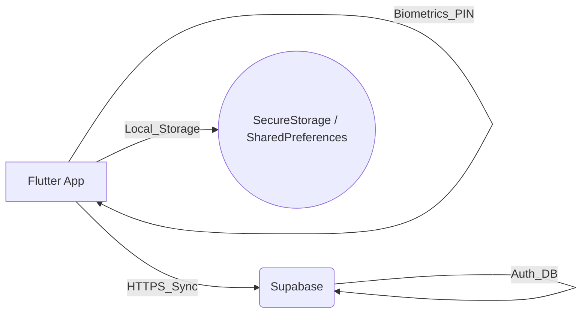
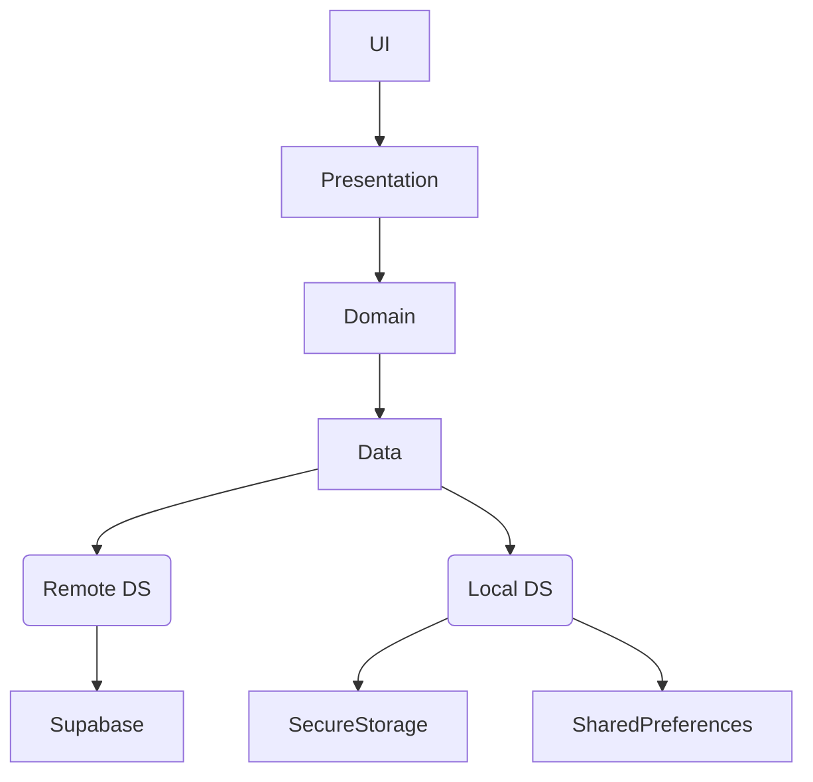
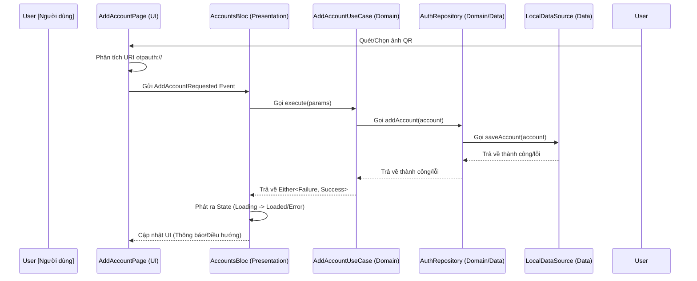
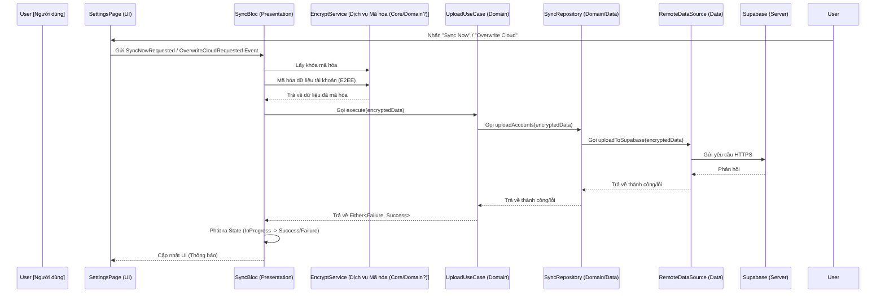
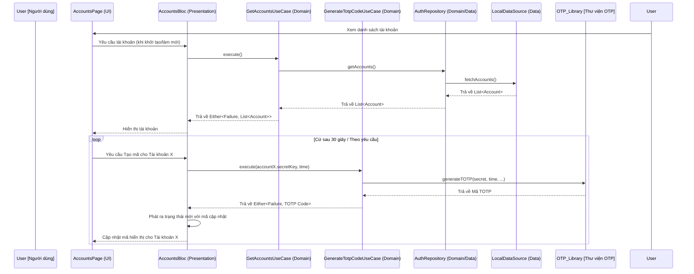
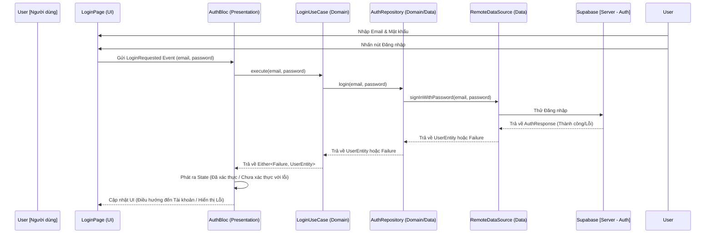
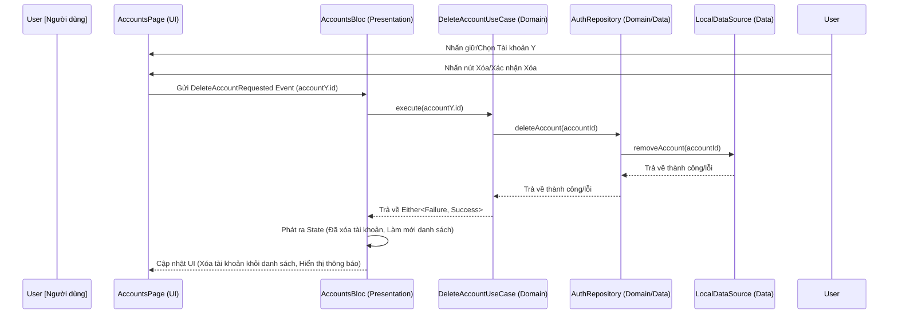
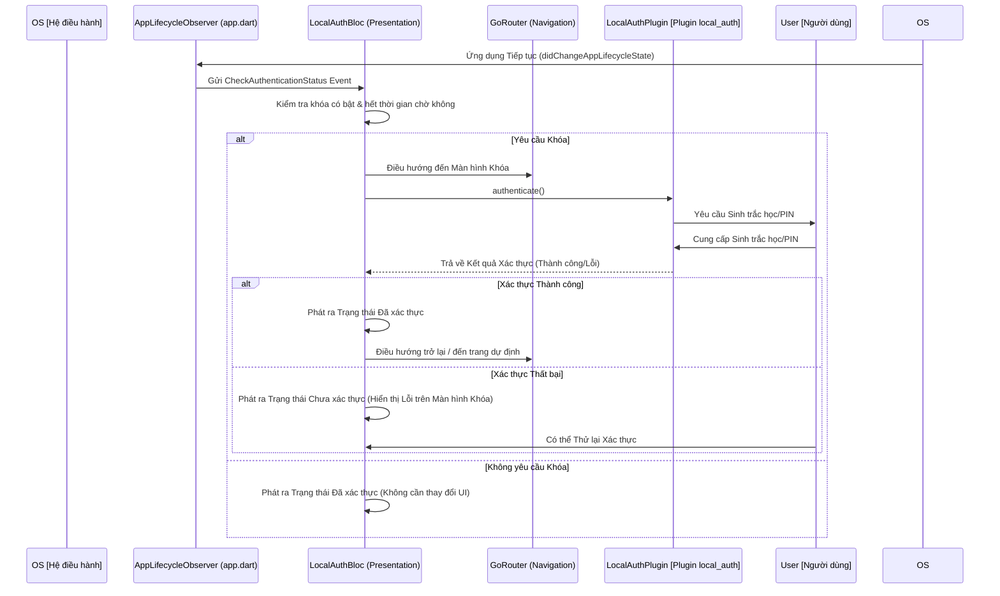

# Hyper Authenticator: Tài liệu Thiết kế Hệ thống

## 1. Giới thiệu
Tài liệu này phác thảo thiết kế hệ thống và kiến trúc cho Hyper Authenticator, một ứng dụng xác thực hai yếu tố (2FA) đa nền tảng được xây dựng bằng Flutter. Nó trình bày chi tiết các lựa chọn kiến trúc, thành phần, luồng dữ liệu và các cân nhắc về bảo mật, phù hợp với mục tiêu của dự án là cung cấp giải pháp 2FA dựa trên TOTP mạnh mẽ và an toàn trên nhiều nền tảng (Android, iOS, Web, Windows, macOS) với tích hợp sinh trắc học.

## 2. Kiến trúc Hệ thống: Mô hình Client-Server
Hyper Authenticator chủ yếu hoạt động như một ứng dụng phía máy khách nhưng sử dụng mô hình Client-Server cho các tính năng tùy chọn như xác thực người dùng và đồng bộ hóa đám mây.

*   **Client (Ứng dụng Flutter):** Ứng dụng cốt lõi chạy trên thiết bị của người dùng (Android, iOS, Web, Windows, macOS). Nó xử lý:
    *   Lưu trữ an toàn các khóa bí mật TOTP.
    *   Tạo mã TOTP (RFC 6238).
    *   Giao diện người dùng và tương tác.
    *   Xác thực sinh trắc học/PIN để khóa ứng dụng.
    *   Quét mã QR và phân tích hình ảnh.
    *   (Nếu bật đồng bộ hóa) Giao tiếp với backend để đồng bộ hóa dữ liệu.
*   **Server (Supabase):** Một nền tảng Backend-as-a-Service (BaaS) được sử dụng cho:
    *   **Xác thực người dùng:** Quản lý đăng ký và đăng nhập người dùng, cho phép người dùng có tài khoản liên kết với dữ liệu được đồng bộ hóa của họ.
    *   **Cơ sở dữ liệu/Lưu trữ:** Lưu trữ an toàn dữ liệu tài khoản người dùng đã được mã hóa (khóa bí mật TOTP, nhà phát hành, tên tài khoản, v.v.) khi đồng bộ hóa đám mây được bật. Supabase cung cấp các giải pháp cơ sở dữ liệu và lưu trữ phù hợp cho mục đích này.

**Sơ đồ (Đơn giản hóa cho GitHub Rendering):**

## 3. Kiến trúc Ứng dụng Flutter: Clean Architecture

**Sơ đồ phân lớp (Đơn giản hóa cho GitHub Rendering):**

Ứng dụng Flutter tuân thủ các nguyên tắc của Clean Architecture để đảm bảo sự tách biệt các mối quan tâm, khả năng kiểm thử và bảo trì.

*   **Nguyên tắc cốt lõi:**
    *   **Presentation Layer:** Xử lý UI (Widgets, Pages) và Quản lý trạng thái. Chịu trách nhiệm hiển thị dữ liệu và xử lý đầu vào của người dùng.
        *   **UI:** Được xây dựng bằng các widget Flutter.
        *   **Quản lý trạng thái:** Chủ yếu sử dụng `flutter_bloc` (`AccountsBloc`, `AuthBloc`, `SyncBloc`, `LocalAuthBloc`, `SettingsBloc`) để quản lý trạng thái tính năng và `provider` để quản lý theme (`ThemeProvider`).
    *   **Domain Layer:** Chứa logic nghiệp vụ cốt lõi, độc lập với UI và chi tiết lưu trữ dữ liệu.
        *   **Entities:** Đại diện cho các đối tượng nghiệp vụ cốt lõi (ví dụ: `AuthenticatorAccount`, `UserEntity`).
        *   **UseCases:** Đóng gói các tác vụ ứng dụng cụ thể (ví dụ: `AddAccountUseCase`, `GetAccountsUseCase`, `GenerateTotpCodeUseCase`, `DeleteAccountUseCase`, `LoginUseCase`, `LogoutUseCase`, `UploadAccountsUseCase`, `DownloadAccountsUseCase`, `CheckAuthStatusUseCase`, `AuthenticateWithBiometricsUseCase`).
        *   **Repository Interfaces:** Định nghĩa các hợp đồng cho các hoạt động dữ liệu, được triển khai bởi Data Layer.
    *   **Data Layer:** Triển khai các interface repository được định nghĩa trong Domain Layer. Chịu trách nhiệm truy xuất dữ liệu từ và lưu trữ dữ liệu vào các nguồn khác nhau.
        *   **Repositories:** Các triển khai cụ thể (ví dụ: `AuthenticatorRepositoryImpl`, `SyncRepositoryImpl`).
        *   **Data Sources:** Trừu tượng hóa tương tác với các cơ chế lưu trữ cụ thể (ví dụ: `AuthenticatorLocalDataSource`, `SyncRemoteDataSource`, `AuthRemoteDataSource`). Các triển khai cụ thể tương tác với Supabase, `FlutterSecureStorage`, `SharedPreferences`.
        *   **Data Models/DTOs:** Các đối tượng truyền dữ liệu được sử dụng để giao tiếp với các dịch vụ bên ngoài hoặc cho các định dạng lưu trữ dữ liệu cụ thể (ví dụ: `SyncedAccountDto`). Thường bao gồm logic ánh xạ đến/từ Domain Entities.
*   **Cân nhắc Đa nền tảng:** Framework Flutter cho phép xây dựng cho nhiều nền tảng từ một cơ sở mã duy nhất. Các tích hợp cụ thể cho nền tảng (như `local_auth` cho sinh trắc học) được xử lý bằng các plugin trừu tượng hóa sự khác biệt giữa các nền tảng. Kiến trúc vẫn nhất quán trên các nền tảng.
*   **Cấu trúc thư mục:** Được tổ chức theo tính năng (`auth`, `authenticator`, `sync`, `settings`) với các lớp `data`, `domain`, `presentation` bên trong, thúc đẩy tính mô-đun.

## 4. Phân tích sâu về Công nghệ chính
*   **Thuật toán TOTP (RFC 6238):**
    *   Sử dụng package `otp`, triển khai thuật toán TOTP tiêu chuẩn.
    *   Nó nhận một khóa bí mật được mã hóa Base32, thời gian hiện tại và các tham số (khoảng thời gian, số chữ số, thuật toán - SHA1, SHA256, SHA512) để tạo mật khẩu dùng một lần dựa trên thời gian.
    *   Các khóa bí mật được lưu trữ an toàn cục bộ bằng `FlutterSecureStorage`.
*   **Công nghệ Sinh trắc học (`local_auth`):**
    *   Plugin `local_auth` cung cấp quyền truy cập vào khả năng xác thực sinh trắc học gốc của thiết bị (vân tay, nhận dạng khuôn mặt) hoặc PIN/mẫu hình/mật khẩu.
    *   Được sử dụng cho tính năng Khóa ứng dụng (`LockScreenPage`, `LocalAuthBloc`).
    *   `LocalAuthBloc` quản lý trạng thái xác thực (đã khóa/mở khóa) và tương tác với plugin.
    *   Vòng đời ứng dụng (`WidgetsBindingObserver` trong `app.dart`) kích hoạt kiểm tra xác thực khi ứng dụng tiếp tục và đặt lại trạng thái khi tạm dừng, đảm bảo an ninh.
*   **Dependency Injection (`GetIt` / `Injectable`):**
    *   Đơn giản hóa việc quản lý dependency giữa các lớp.
    *   `Injectable` tự động tạo mã đăng ký dựa trên các annotation (`@injectable`, `@lazySingleton`, `@module`, `@preResolve`).
    *   Đảm bảo khớp nối lỏng lẻo và cải thiện khả năng kiểm thử.
*   **Routing (`GoRouter`):**
    *   Cung cấp giải pháp định tuyến khai báo phù hợp cho các kịch bản điều hướng phức tạp.
    *   Cấu hình router (`AppRouter`) phụ thuộc vào trạng thái của `AuthBloc` và `LocalAuthBloc` để xử lý chuyển hướng (ví dụ: chuyển hướng đến đăng nhập nếu chưa xác thực, chuyển hướng đến màn hình khóa nếu khóa ứng dụng được bật và kích hoạt).
    *   **Lưu trữ cục bộ (`FlutterSecureStorage` / `SharedPreferences`):**
        *   `FlutterSecureStorage` được chọn cho dữ liệu nhạy cảm (khóa bí mật TOTP, có thể là khóa E2EE) vì nó sử dụng bộ nhớ an toàn dành riêng cho nền tảng (Keystore/Keychain), cung cấp bảo vệ dựa trên phần cứng nếu có.
        *   `SharedPreferences` được sử dụng cho các tùy chọn người dùng không nhạy cảm (như cài đặt theme, trạng thái bật/tắt đồng bộ hóa) vì nó đơn giản hơn và đủ dùng cho dữ liệu không quan trọng.

## 5. Cân nhắc về Bảo mật
*   **Lưu trữ cục bộ:**
    *   **Dữ liệu nhạy cảm (Khóa bí mật TOTP):** Được lưu trữ bằng `FlutterSecureStorage`, tận dụng các cơ chế lưu trữ an toàn cụ thể của nền tảng (Keystore trên Android, Keychain trên iOS).
    *   **Dữ liệu không nhạy cảm (Cài đặt):** Được lưu trữ bằng `SharedPreferences`.
*   **Khóa ứng dụng:** Sử dụng xác thực sinh trắc học/PIN cấp thiết bị thông qua `local_auth`, ngăn chặn truy cập trái phép vào ứng dụng ngay cả khi thiết bị đã được mở khóa.
*   **Bảo mật Đồng bộ hóa Đám mây (Hiện tại & Kế hoạch):**
    *   **Xác thực:** Xác thực người dùng qua Supabase đảm bảo chỉ người dùng được ủy quyền mới có thể truy cập dữ liệu đồng bộ hóa của họ.
    *   **Bảo mật truyền tải:** Giao tiếp với Supabase diễn ra qua HTTPS.
    *   **Dữ liệu khi lưu trữ (Supabase - Trạng thái hiện tại):** Hiện tại, dữ liệu được đồng bộ hóa lên Supabase dựa vào các tính năng bảo mật tích hợp của Supabase và có thể là các tùy chọn mã hóa phía máy chủ do nền tảng cung cấp. Các khóa bí mật TOTP thô có thể được lưu trữ trực tiếp nếu E2EE chưa được triển khai.
    *   **Kế hoạch Mã hóa Đầu cuối (E2EE):**
        *   **Mục tiêu:** Đảm bảo rằng các khóa bí mật TOTP nhạy cảm được mã hóa *trước khi* rời khỏi thiết bị khách, khiến chúng không thể đọc được bởi nhà cung cấp backend (Supabase) hoặc bất kỳ bên trung gian nào.
        *   **Phương pháp:**
            1.  **Tạo khóa:** Tạo một khóa mã hóa mạnh, duy nhất cho mỗi người dùng ở phía máy khách. Các tùy chọn bao gồm:
                *   Tạo ra từ mật khẩu chính do người dùng xác định (sử dụng KDF như Argon2 hoặc PBKDF2).
                *   Tạo khóa ngẫu nhiên và lưu trữ an toàn trong `FlutterSecureStorage`.
            2.  **Mã hóa:** Trước khi tải lên qua `UploadAccountsUseCase`, mã hóa các trường nhạy cảm (đặc biệt là `secretKey`) bằng khóa phía máy khách (ví dụ: AES-GCM qua package `cryptography`).
            3.  **Lưu trữ:** Chỉ lưu trữ bản mã *đã mã hóa* trong Supabase.
            4.  **Giải mã:** Khi tải xuống qua `DownloadAccountsUseCase`, truy xuất bản mã và giải mã nó ở phía máy khách bằng khóa của người dùng.
        *   **Thách thức Quản lý Khóa:**
            *   **Bảo mật:** Khóa phía máy khách là gốc của sự tin cậy. Nếu được lưu trữ trực tiếp, `FlutterSecureStorage` là cần thiết. Nếu được tạo ra, mật khẩu chính phải mạnh.
            *   **Khôi phục:** Nếu khóa (hoặc mật khẩu chính) bị mất, dữ liệu đã mã hóa sẽ không thể truy cập được. Việc triển khai cơ chế khôi phục an toàn (ví dụ: mã khôi phục do người dùng lưu trữ) rất phức tạp nhưng cần thiết.
            *   **Truy cập Đa thiết bị:** Khóa phải có sẵn trên tất cả các thiết bị mà người dùng muốn truy cập dữ liệu đã đồng bộ hóa. Điều này có thể liên quan đến việc chuyển khóa một cách an toàn hoặc yêu cầu người dùng nhập lại mật khẩu chính trên mỗi thiết bị mới.

## 6. Ví dụ về Luồng dữ liệu

### 6.1. Thêm tài khoản qua Quét/Chọn ảnh QR

**Mô tả:** Luồng này minh họa cách người dùng thêm tài khoản 2FA mới bằng cách quét mã QR hoặc chọn hình ảnh chứa mã đó. Ứng dụng phân tích URI `otpauth://`, lưu chi tiết tài khoản một cách an toàn vào bộ nhớ cục bộ thông qua các lớp BLoC và Repository.

### 6.2. Luồng Đồng bộ hóa (Tải lên với E2EE dự kiến)

**Mô tả:** Sơ đồ này cho thấy quá trình tải dữ liệu tài khoản cục bộ lên backend Supabase để đồng bộ hóa. Nó bao gồm bước Mã hóa Đầu cuối (E2EE) dự kiến, nơi dữ liệu được mã hóa phía máy khách trước khi gửi đi, đảm bảo máy chủ không thể truy cập các khóa bí mật thô.

### 6.3. Tạo mã TOTP

**Mô tả:** Luồng này trình bày chi tiết cách ứng dụng tạo Mật khẩu dùng một lần dựa trên thời gian (TOTP) cho một tài khoản đã chọn. Nó bao gồm việc truy xuất khóa bí mật của tài khoản từ bộ nhớ an toàn và sử dụng thư viện `otp` để tính toán mã hiện tại dựa trên thời gian.

### 6.4. Xác thực Người dùng (Đăng nhập)

**Mô tả:** Sơ đồ này phác thảo quy trình đăng nhập người dùng bằng xác thực Supabase. Người dùng nhập thông tin đăng nhập, thông tin này được chuyển qua các lớp BLoC và UseCase đến Repository, cuối cùng gọi dịch vụ Supabase Auth để xác minh.

### 6.5. Xóa Tài khoản

**Mô tả:** Luồng này cho thấy cách người dùng xóa một tài khoản 2FA hiện có. Yêu cầu đi qua BLoC và UseCase đến Repository, sau đó hướng dẫn Local Data Source xóa tài khoản khỏi bộ nhớ an toàn.

### 6.6. Xác thực Khóa ứng dụng (Khi ứng dụng tiếp tục)

**Mô tả:** Sơ đồ này minh họa quy trình khi ứng dụng tiếp tục từ nền và tính năng Khóa ứng dụng được bật. `WidgetsBindingObserver` kích hoạt `LocalAuthBloc` để kiểm tra xem có cần xác thực hay không, sau đó tương tác với plugin `local_auth` để nhắc người dùng nhập sinh trắc học/PIN.

## 7. Xử lý lỗi
Ứng dụng sử dụng rộng rãi mẫu `Either<Failure, SuccessType>` (từ package `dartz`) trong các lớp Domain và Data để xử lý các lỗi dự kiến một cách nhẹ nhàng mà không ném ngoại lệ cho các vấn đề phổ biến.

*   **Các loại `Failure`:** Các lớp con `Failure` cụ thể đại diện cho các loại lỗi khác nhau:
    *   `ServerFailure`: Lỗi từ backend (ví dụ: lỗi API Supabase, mã trạng thái 5xx).
    *   `CacheFailure`: Lỗi liên quan đến lưu trữ cục bộ (ví dụ: lỗi đọc/ghi `FlutterSecureStorage`).
    *   `NetworkFailure`: Sự cố với kết nối mạng.
    *   `AuthenticationFailure`: Lỗi trong quá trình đăng nhập, đăng ký hoặc các vấn đề về token.
    *   `EncryptionFailure`: Lỗi trong quá trình mã hóa/giải mã E2EE.
    *   `PermissionFailure`: Lỗi liên quan đến quyền bị thiếu (ví dụ: camera để quét QR).
    *   `InvalidInputFailure`: Lỗi do đầu vào không hợp lệ của người dùng (mặc dù thường được xử lý thông qua xác thực biểu mẫu trong Presentation).
*   **Xử lý ở Presentation Layer:** Các BLoC nhận kiểu `Either` từ UseCases.
    *   Khi nhận `Left(Failure)`, BLoC phát ra trạng thái lỗi (ví dụ: `AccountsLoadFailure`, `SyncFailure`).
    *   Lớp UI lắng nghe các trạng thái này và hiển thị phản hồi phù hợp cho người dùng (ví dụ: SnackBar, thông báo lỗi trong widget, trang lỗi cụ thể). Phản hồi nhằm mục đích thân thiện với người dùng, giải thích vấn đề một cách đơn giản (ví dụ: "Không thể kết nối đến máy chủ", "Thông tin đăng nhập không hợp lệ", "Không thể lưu tài khoản").
    *   Khi nhận `Right(SuccessType)`, BLoC phát ra trạng thái thành công với dữ liệu cần thiết.
Sử dụng `Either<Failure, SuccessType>` và các loại `Failure` cụ thể.