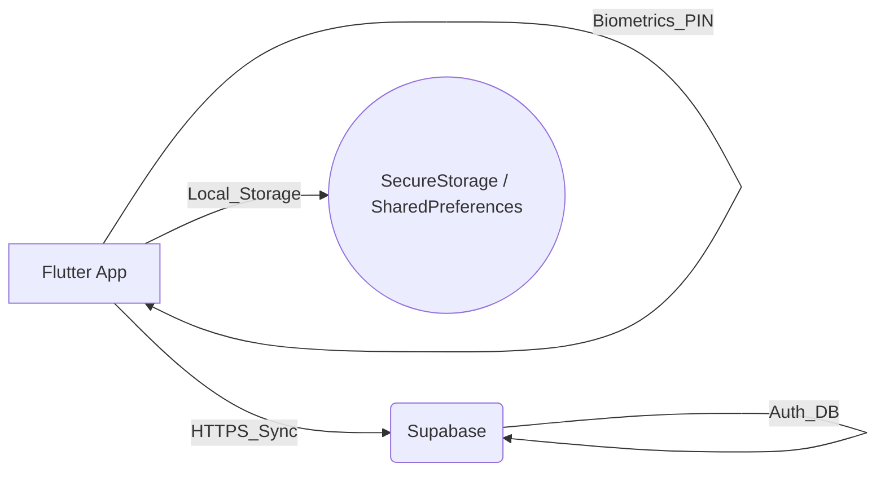
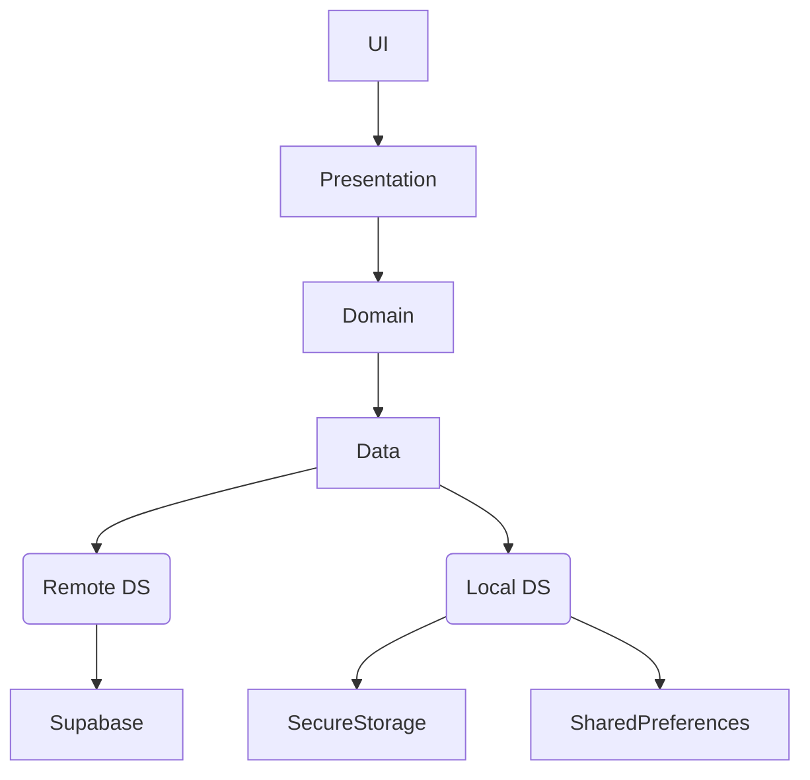
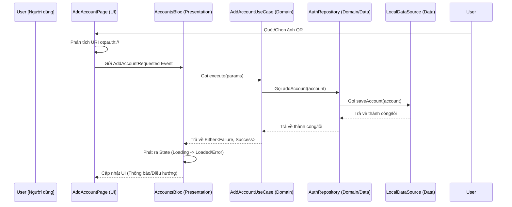
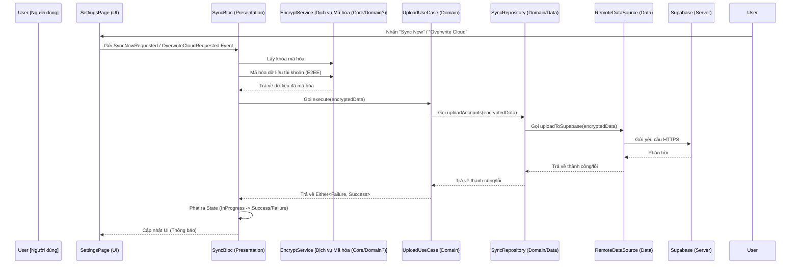
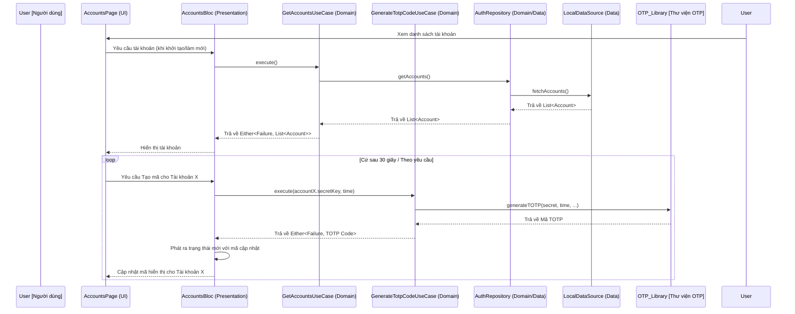
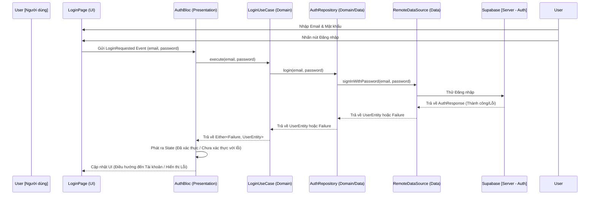

# Hyper Authenticator: Tài liệu Thiết kế Hệ thống

## 1. Giới thiệu
Tài liệu này phác thảo thiết kế hệ thống và kiến trúc cho Hyper Authenticator, một ứng dụng xác thực hai yếu tố (2FA) đa nền tảng được xây dựng bằng Flutter. Nó trình bày chi tiết các lựa chọn kiến trúc, thành phần, luồng dữ liệu và các cân nhắc về bảo mật, phù hợp với mục tiêu của dự án là cung cấp giải pháp 2FA dựa trên TOTP mạnh mẽ và an toàn trên nhiều nền tảng (Android, iOS, Web, Windows, macOS) với tích hợp sinh trắc học.

## 2. Kiến trúc Hệ thống: Mô hình Client-Server
Hyper Authenticator chủ yếu hoạt động như một ứng dụng phía máy khách nhưng sử dụng mô hình Client-Server cho các tính năng tùy chọn như xác thực người dùng và đồng bộ hóa đám mây.

*   **Client (Ứng dụng Flutter):** Ứng dụng cốt lõi chạy trên thiết bị của người dùng (Android, iOS, Web, Windows, macOS). Nó xử lý:
    *   Lưu trữ an toàn các khóa bí mật TOTP.
    *   Tạo mã TOTP (RFC 6238).
    *   Giao diện người dùng và tương tác.
    *   Xác thực sinh trắc học/PIN để khóa ứng dụng.
    *   Quét mã QR và phân tích hình ảnh.
    *   (Nếu bật đồng bộ hóa) Giao tiếp với backend để đồng bộ hóa dữ liệu.
*   **Server (Supabase):** Một nền tảng Backend-as-a-Service (BaaS) được sử dụng cho:
    *   **Xác thực người dùng:** Quản lý đăng ký và đăng nhập người dùng, cho phép người dùng có tài khoản liên kết với dữ liệu được đồng bộ hóa của họ.
    *   **Cơ sở dữ liệu/Lưu trữ:** Lưu trữ an toàn dữ liệu tài khoản người dùng đã được mã hóa (khóa bí mật TOTP, nhà phát hành, tên tài khoản, v.v.) khi đồng bộ hóa đám mây được bật. Supabase cung cấp các giải pháp cơ sở dữ liệu và lưu trữ phù hợp cho mục đích này.

**Sơ đồ (Đơn giản hóa cho GitHub Rendering):**

## 3. Kiến trúc Ứng dụng Flutter: Clean Architecture

**Sơ đồ phân lớp (Đơn giản hóa cho GitHub Rendering):**

Ứng dụng Flutter tuân thủ các nguyên tắc của Clean Architecture để đảm bảo sự tách biệt các mối quan tâm, khả năng kiểm thử và bảo trì.

*   **Nguyên tắc cốt lõi:**
    *   **Presentation Layer:** UI (Widgets, Pages) và Quản lý trạng thái (BLoC). Chịu trách nhiệm hiển thị dữ liệu và xử lý đầu vào của người dùng. Sử dụng `flutter_bloc` để quản lý trạng thái và `provider` để quản lý theme.
    *   **Domain Layer:** Logic nghiệp vụ cốt lõi (UseCases, Entities) và các interface Repository. Xác định *cái gì* ứng dụng làm, độc lập với chi tiết triển khai. Chứa entity `AuthenticatorAccount` và các use case như `AddAccount`, `GenerateTotpCode`, `GetAccounts`.
    *   **Data Layer:** Triển khai các Repository, Data Sources (local và remote), và ánh xạ dữ liệu. Chịu trách nhiệm *cách thức* dữ liệu được lấy và lưu trữ. Bao gồm `AuthenticatorRepositoryImpl`, `AuthenticatorLocalDataSource`, `SyncRemoteDataSource`, v.v.
*   **Cân nhắc Đa nền tảng:** Framework Flutter cho phép xây dựng cho nhiều nền tảng từ một cơ sở mã duy nhất. Các tích hợp cụ thể cho nền tảng (như `local_auth` cho sinh trắc học) được xử lý bằng các plugin trừu tượng hóa sự khác biệt giữa các nền tảng. Kiến trúc vẫn nhất quán trên các nền tảng.
*   **Cấu trúc thư mục:** Được tổ chức theo tính năng (`auth`, `authenticator`, `sync`, `settings`) với các lớp `data`, `domain`, `presentation` bên trong, thúc đẩy tính mô-đun.

## 4. Phân tích sâu về Công nghệ chính
*   **Thuật toán TOTP (RFC 6238):**
    *   Sử dụng package `otp`, triển khai thuật toán TOTP tiêu chuẩn.
    *   Nó nhận một khóa bí mật được mã hóa Base32, thời gian hiện tại và các tham số (khoảng thời gian, số chữ số, thuật toán - SHA1, SHA256, SHA512) để tạo mật khẩu dùng một lần dựa trên thời gian.
    *   Các khóa bí mật được lưu trữ an toàn cục bộ bằng `FlutterSecureStorage`.
*   **Công nghệ Sinh trắc học (`local_auth`):**
    *   Plugin `local_auth` cung cấp quyền truy cập vào khả năng xác thực sinh trắc học gốc của thiết bị (vân tay, nhận dạng khuôn mặt) hoặc PIN/mẫu hình/mật khẩu.
    *   Được sử dụng cho tính năng Khóa ứng dụng (`LockScreenPage`, `LocalAuthBloc`).
    *   `LocalAuthBloc` quản lý trạng thái xác thực (đã khóa/mở khóa) và tương tác với plugin.
    *   Vòng đời ứng dụng (`WidgetsBindingObserver` trong `app.dart`) kích hoạt kiểm tra xác thực khi ứng dụng tiếp tục và đặt lại trạng thái khi tạm dừng, đảm bảo an ninh.
*   **Dependency Injection (`GetIt` / `Injectable`):**
    *   Đơn giản hóa việc quản lý dependency giữa các lớp.
    *   `Injectable` tự động tạo mã đăng ký dựa trên các annotation (`@injectable`, `@lazySingleton`, `@module`, `@preResolve`).
    *   Đảm bảo khớp nối lỏng lẻo và cải thiện khả năng kiểm thử.
*   **Routing (`GoRouter`):**
    *   Cung cấp giải pháp định tuyến khai báo phù hợp cho các kịch bản điều hướng phức tạp.
    *   Cấu hình router (`AppRouter`) phụ thuộc vào trạng thái của `AuthBloc` và `LocalAuthBloc` để xử lý chuyển hướng (ví dụ: chuyển hướng đến đăng nhập nếu chưa xác thực, chuyển hướng đến màn hình khóa nếu khóa ứng dụng được bật và kích hoạt).

## 5. Cân nhắc về Bảo mật
*   **Lưu trữ cục bộ:**
    *   **Dữ liệu nhạy cảm (Khóa bí mật TOTP):** Được lưu trữ bằng `FlutterSecureStorage`, tận dụng các cơ chế lưu trữ an toàn cụ thể của nền tảng (Keystore trên Android, Keychain trên iOS).
    *   **Dữ liệu không nhạy cảm (Cài đặt):** Được lưu trữ bằng `SharedPreferences`.
*   **Khóa ứng dụng:** Sử dụng xác thực sinh trắc học/PIN cấp thiết bị thông qua `local_auth`, ngăn chặn truy cập trái phép vào ứng dụng ngay cả khi thiết bị đã được mở khóa.
*   **Bảo mật Đồng bộ hóa Đám mây (Hiện tại & Kế hoạch):**
    *   **Xác thực:** Xác thực người dùng qua Supabase đảm bảo chỉ người dùng được ủy quyền mới có thể truy cập dữ liệu đồng bộ hóa của họ.
    *   **Bảo mật truyền tải:** Giao tiếp với Supabase diễn ra qua HTTPS.
    *   **Dữ liệu khi lưu trữ (Supabase):** Supabase cung cấp các tùy chọn mã hóa phía máy chủ.
    *   **Kế hoạch Mã hóa Đầu cuối (E2EE):**
        *   **Mục tiêu:** Đảm bảo rằng ngay cả nhà cung cấp backend (Supabase) cũng không thể đọc được khóa bí mật TOTP nhạy cảm của người dùng được lưu trữ để đồng bộ hóa.
        *   **Phương pháp:**
            1.  **Tạo khóa:** Tạo một khóa mã hóa mạnh ở phía máy khách. Khóa này có thể được tạo ra từ mật khẩu chính của người dùng (yêu cầu người dùng đặt mật khẩu) hoặc tạo ngẫu nhiên và lưu trữ an toàn (ví dụ: trong `FlutterSecureStorage`, có thể được bảo vệ bằng sinh trắc học). *Quản lý khóa này một cách an toàn là rất quan trọng.*
            2.  **Mã hóa:** Trước khi tải lên dữ liệu tài khoản (chi tiết `AuthenticatorAccount`) thông qua `UploadAccountsUseCase`, mã hóa các trường nhạy cảm (đặc biệt là `secretKey`) bằng khóa phía máy khách và package `cryptography` (ví dụ: AES-GCM).
            3.  **Lưu trữ:** Lưu trữ dữ liệu *đã mã hóa* trong Supabase.
            4.  **Giải mã:** Khi tải xuống dữ liệu qua `DownloadAccountsUseCase`, truy xuất dữ liệu đã mã hóa và giải mã nó ở phía máy khách bằng cùng một khóa phía máy khách.
        *   **Thách thức:** Quản lý khóa an toàn, khôi phục khóa (nếu người dùng quên mật khẩu chính hoặc mất khóa) và đảm bảo khóa có sẵn trên các thiết bị nếu cần để giải mã sau khi cài đặt mới.

## 6. Ví dụ về Luồng dữ liệu

### 6.1. Thêm tài khoản qua Quét/Chọn ảnh QR

**Mô tả:** Luồng này minh họa cách người dùng thêm tài khoản 2FA mới bằng cách quét mã QR hoặc chọn hình ảnh chứa mã đó. Ứng dụng phân tích URI `otpauth://`, lưu chi tiết tài khoản một cách an toàn vào bộ nhớ cục bộ thông qua các lớp BLoC và Repository.

### 6.2. Luồng Đồng bộ hóa (Tải lên với E2EE dự kiến)

**Mô tả:** Sơ đồ này cho thấy quá trình tải dữ liệu tài khoản cục bộ lên backend Supabase để đồng bộ hóa. Nó bao gồm bước Mã hóa Đầu cuối (E2EE) dự kiến, nơi dữ liệu được mã hóa phía máy khách trước khi gửi đi, đảm bảo máy chủ không thể truy cập các khóa bí mật thô.

### 6.3. Tạo mã TOTP

**Mô tả:** Luồng này trình bày chi tiết cách ứng dụng tạo Mật khẩu dùng một lần dựa trên thời gian (TOTP) cho một tài khoản đã chọn. Nó bao gồm việc truy xuất khóa bí mật của tài khoản từ bộ nhớ an toàn và sử dụng thư viện `otp` để tính toán mã hiện tại dựa trên thời gian.

### 6.4. Xác thực Người dùng (Đăng nhập)

**Mô tả:** Sơ đồ này phác thảo quy trình đăng nhập người dùng bằng xác thực Supabase. Người dùng nhập thông tin đăng nhập, thông tin này được chuyển qua các lớp BLoC và UseCase đến Repository, cuối cùng gọi dịch vụ Supabase Auth để xác minh.

## 7. Xử lý lỗi
Sử dụng `Either<Failure, SuccessType>` và các loại `Failure` cụ thể.